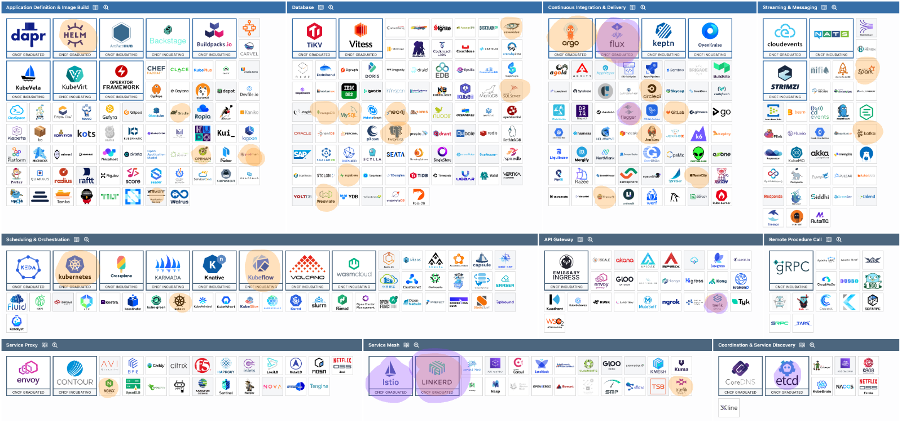

## DBaaS vs DIY Postgres EX 3.06

### Database as a Service (DBaaS)

**Pros**  
- Very easy to set up: just create an instance in the cloud console.  
- Automatic backups and point-in-time recovery are built-in.  
- Automatic patching and updates by the cloud provider.  
- High availability (replicas, failover) is usually simple to enable.  

**Cons**  
- Can be more expensive if you need bigger instances or high-performance storage.  
- Less control over the database configuration and filesystem.  
- If you use some special Postgres features or extensions, they might not be supported.  

---

### DIY Postgres with PersistentVolumeClaims

**Pros**  
- Full control over Postgres settings, extensions, and versioning.  
- Typically cheaper at smaller scales, since you just pay for VMs and storage.  
- Easier to do local experiments, because you can run the same setup locally with Docker or Kubernetes.  

**Cons**  
- You have to manage updates, backups, and recovery strategies yourself.  
- More complicated to set up high availability (StatefulSets, replication, etc.).  
- Risk of data loss if you misconfigure volumes or forget to set up backups.  
- Requires more maintenance work (monitoring, scaling, patching).  

### Ex 5.05 platform comparison

#### Rancher

- Easy to install and manage multiple Kubernetes clusters.
- Open-source, with a friendly community.
- Works well with different clouds (AWS, GCP, Azure) or on-premise systems.
- Lightweight and flexible, not tied to one provider.

#### OpenShift

- Built by Red Hat, with enterprise support and security features.
- Offers built-in CI/CD tools for faster development.
- Includes opinionated defaults, which can simplify some tasks but reduce flexibility.

#### Why Rancher is “better”:

- Simpler to set up.
- More flexible across different environments.
- Light and open-source, good for quick deployments.

# Exercise 5.08: Tools Used vs. Indirect Dependencies

---

## Direct Usage

1. **Helm**  
   - *Usage:* Installed Prometheus in Part 2 using Helm.  

2. **NGINX**  
   - *Usage:* Deployed the NGINX Ingress Controller in Part 2.  

3. **Kubernetes**  
   - *Usage:* The main orchestrator used throughout the course (k3s/k3d locally, GKE in the cloud).  

4. **Argo (Argo CD)**  
   - *Usage:* Used Argo CD in Part 4 for GitOps.  

5. **GitHub Actions**  
   - *Usage:* Employed GitHub Actions as the CI/CD pipeline.

6. **Postqresql**  
   - *Usage:* Database for the project.

---

## Indirect Usage

1. **Flannel**  
   - *Usage:* Indirectly used as the default network plugin in k3s/k3d.  

2. **containerd**  
   - *Usage:* The default container runtime under Kubernetes (e.g., GKE).  

3. **etcd**  
   - *Usage:* Kubernetes uses etcd internally to store cluster state.  
   - *Details:* Didn’t directly interact with etcd, but it’s essential for Kubernetes.

5. **Traefik**
    - *Usage:* Default ingress Controller in k3ds

